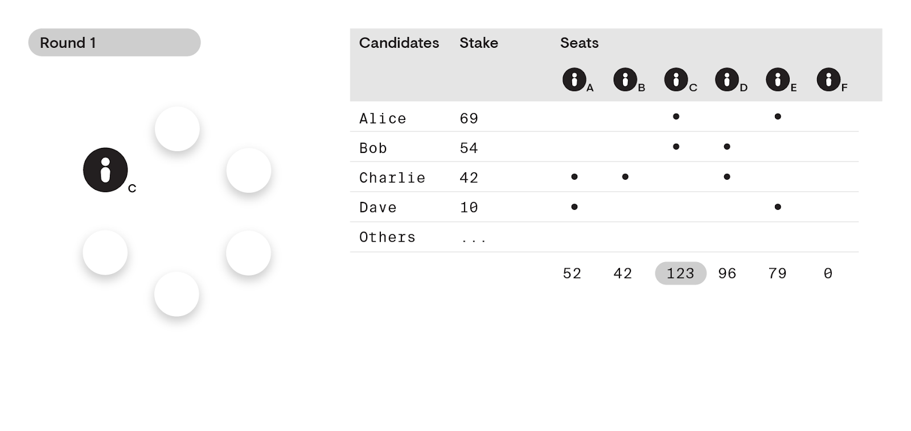
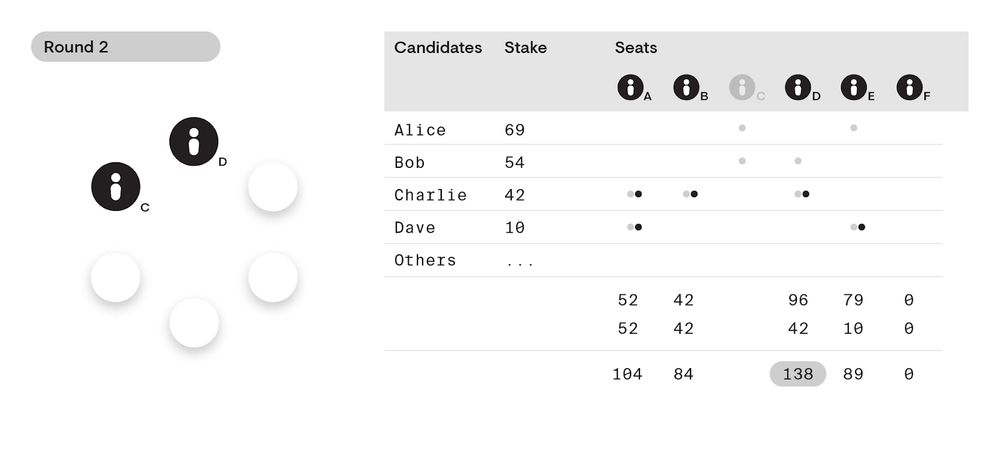

# Review of Polkadot Treasury and other fund allocation solutions

## Intro
### Context
This is the following presentation of DAOs overview for the research I'm doing
for a possibility to migrate and run PolkaDAO on Polkadot, Kusama or other
substrate-based chain.  

This time I'm trying out to find what is Treasury module, is it an optimal
solution to run DAO on Polkadot, what are other existing solutions for running
DAO in the ecosystem and what are possible ways to build a new one.  

This demo will last up to 2 hours.

### Plot
- [Polkadot Governance basics](#polkadot-governance-basics)
- [Treasury module](#treasury)
  - [Spending proposals](#proposals) 
  - [Tips](#tipping)
  - [Treasury bounties 🆕](#treasury-bounties)
- [Multisig accounts](#multisig-accounts)
- [DAO parachains](#known-dao-solutions-to-work-as-parachians) 
- [ink!/smart-contract solutions](#smart-contracts-(ink!)-solution)
- [Conclusions](#conclusions)

## Polkadot Governance basics
> The common factors boil down to governance being:
>
> - A system of rules
> - To make decisions
> - With participants being held accountable  

Quoted from [Governance 101]

### Participants in Polkadot governance

  * **DOT/KSM/token holders**
    DOT holders can use their DOTs in Polkadot governance in the following ways:

    * Propose a public referendum  
    * Prioritize public referenda  
    * Vote on all active referenda  
    * Vote for council members  
    * Become a council member  

    DOTs also allow participants to stake their DOTs to validate on the network,
    or engage in the voting for validators, called “nominating”.  

  - **The council**  
    To represent passive stakeholders who may not be able to vote on every
    referenda, Polkadot introduces the Council, a body of 6-24 members who will
    gain prioritized voting rights over the Polkadot network. The council will
    be elected with the ambition of proposing sensible referenda, as council
    members will stake their expertise and experience in developing, maintaining
    and using decentralized networks.
    
    Council members have the ability to veto incoming proposals. After a
    cool-down period, however, these proposals can be re-submitted and the
    council member that vetoed the proposal cannot veto this proposal again.
    
### Delayed enactment

Every approved referendum goes through a certain amount of time before it
becomes enacted on-chain. This allows participants who disagree with any
referenda to leave the network, while the DOT holders that voted in support of
this referenda have their DOTs locked until the upgrade is enacted.

### [Joining the council]

In general it has a fixed number of seats (envisioned to be 24 for Polkadot, 13
in Kusama currently) and all members have a fixed term (12 months).
Council members can be removed early only by a referendum.

To elect a new council member, Polkadot employs the same election scheme as used
for choosing the active set of validators, a [Phragmen] election. The election
also chooses a set number of runners up (currently seven in Kusama) that will
remain in the queue with their votes intact.

More governance details

For a referendum to be proposed by the council, a strict majority of members
must be in favor, with no member exercising a veto.

A two-thirds majority of the council can cancel a referendum. 

If the cancellation is controversial enough that the council cannot get a
two-thirds majority, then it will be left to the stakeholders en masse to
determine the fate of the proposal.

Stakeholders are free to signal their approval of any of the registered
candidates.

  
 
### Prime Members ###
The council, being an instantiation of Substrate's Collective pallet, implements
what's called a prime member whose vote acts as the default for other members
that fail to vote before the timeout.

The prime member is chosen based on a [Borda] count.

With the existence of a prime member, it forces councillors to be explicit in
their votes or have their vote counted for whatever is voted on by the prime.

### Practical part
For the testing purposes I introduce USD token equivalent to 1 USD and provide
all of participants with 10000 USD. Council term period is set to 7 minutes,
candidacy bond to 10 USD.  

Let's try:
- Submitting candidacies
- Voting for other candidates
- Defining prime member

# [Treasury] #
The treasury is a pot of funds collected through transaction fees, slashing,
staking inefficiencies, [etc.]. The funds held in the treasury can be spent by
making a spending proposal that, if approved by the council, will enter a
*waiting period* before distribution. This waiting period is known as the
budget or spend period, and its duration is subject to governance, with current
defaults set to 24 days for Polkadot mainnet, and 6 days for Kusama. The
treasury attempts to spend as many proposals in the queue as it can without
running out of funds. If the treasury ends a budget period without spending all
of its funds, it suffers a burn of a percentage of its funds -- thereby causing
deflationary pressure. *This percentage is currently at 0%.*

### Practical part
In current network I don't collect fees for transactions, so I'll have to
manually top up treasury. For this demo Spend period is set to 7 minutes.
- Top up treasury  
  Treasury address: `5EYCAe5ijiYfyeZ2JJCGq56LmPyNRAKzpG4QkoQkkQNB5e6Z`

## Proposals ##
When a stakeholder wishes to propose a spend from the treasury, they must
reserve a deposit totaling 5% of the proposed spend or 20 KSM (whichever is
higher) as an anti-spam measure. 
This deposit will be slashed if the proposal is rejected, and returned if the
proposal was accepted.

Proposals may consist of (but are not limited to):

  - Infrastructure deployment and continued operation.
  - Network security operations (monitoring services, continuous auditing). 
  - Ecosystem provisions (collaborations with friendly chains). 
  - Marketing activities (advertising, paid features, collaborations). 
  - Community events and outreach (meetups, pizza parties, hackerspaces). 
  - Software development (wallets and wallet integration, clients and client
  upgrades).

### Process to create proposal ###
#### Announcing proposal ####
Find an off-chain way to explain the proposal: **riot chat**, **kusama/polkadot
forum**, [kgp repository], commonwealth.im, polkassembly

As council members are taking decision on whether to approve your proposal or
reject it you should search for their support in the first place.

#### Create proposal ####
Use polkadot.js.org/apps UI

#### Moving into motion ####
At this point, a Council member can turn this proposal into a motion to accept,
or a motion to reject. It is possible (but unlikely) that a motion for both
acceptance and rejection is created. In Kusama at the moment after being turned
into a council motion, the proposal needs at least 60% of the council to
approve it to pass, or more than 50% to reject it to fail. If majority is not
reached, the proposal remains in limbo - neither accepted nor rejected until
more council members weigh in. There's a limited time defined for council
members to take decision on whether to support the proposal, for Kusama it is
currently set to 3 days.
[🔗 Kusama treasury settings](https://github.com/paritytech/polkadot/blob/master/runtime/kusama/src/lib.rs#L464)

| Motion to approve                                  | result        |
|----------------------------------------------------|---------------|
| Threshold reached to approve (> 60%)               | approved      |
| Threshold not reached (all voted)                  | back to limbo |
| Threshold not reached (not all voted, prime voted) | approved      |
| Threshold not reached (nobody voted but prime)     | approved      |

| Motion to reject                                   | result        |
|----------------------------------------------------|---------------|
| Threshold reached to reject (≥ 50%)                | rejected      |
| Threshold not reached (all voted)                  | back to limbo |
| Threshold not reached (not all voted, prime voted) | approved      |
| Threshold not reached (nobody voted but prime)     | approved      |

Proposals will stay in limbo forever till council members either reject them or
approve.

-------

#### Practical part
I'm keeping test chain properties same as for Kusama in relation to
approve/reject support. Minimum bond for proposal is set to 10 USD or 5%.
Council motion duration is set to 5 minutes.

Let's try to:
- Create proposals to spend treasury funds
- Move into motion
- Vote as a council on acceptance or rejection of proposal
- View proposal getting enact in the end of the spending period
- Check default voting by prime member
- Let prime voter try to steal funds

## Tipping ##

Next to the proposals process, a separate system for making tips exists for the
treasury. Tipping is a more lean payout method to a predetermined recipient in
which at least a majority of the council members individually provide a
valuation for an activity.

Tips can be suggested by anyone and are supported by members of the
council.  

Tips do not have any definite value, the final value of the tip is
decided based on the median of all tips issued by the tippers.  

Currently on Kusama, tippers are the same as the members of the council.
However, being a tipper is not direct responsibility of the council, and at some
point the council and the tippers may be different groups of accounts.

To make a tip user must lock up a deposit for making the report. The deposit is
the base deposit as set in the chain's parameter list plus the additional
deposit per byte contained in the reason. 

After that the tipper group now collectively (but also independently) decide on
the value of the tip.

Once more than half of the tippers group have issued tip valuations the
countdown to close the tip will begin. 

Now somebody has to call `close_tip` extrinsic at the end of the closing period.

Tip finder will receive the eventual finder's fee if the tip is approved by
the tippers.

### Practical part ###
For this demo I've set `TipCountdown` to 5 minutes, `TipFindersFee` to 20
percent, tip base deposit fee is 1 USD and deposit per byte is 10 cents.  
Let's try:
- From non council account suggest a tip to myself
- Let people vote
- Close tip
- See the average tip being issued

## Treasury bounties ##
Also called Treasury Budgets. This feature is being currently in 
[active discussion](https://kusama.polkassembly.io/post/86)

> Context
>- Council Member apathy (Council Members likely do not have expertise to make a
  proper assessment of the activities described in Spending Proposals.)
>- UI/UX problems
>- Lack of (quality) Spending Proposals
>- Difficulty to curate Spending Proposals

[Reopening the discussion on Bounties and Treasury spending
issues!](https://kusama.polkassembly.io/post/86)

> 'Delegation of the curation activity of Spending Proposals to an expert called
a Curator'.

In contrast to existing Spending Instruments the Bounty Instrument's payout
address is not known in advance.  
A Curator is assigned to be delegated that responsibility by the Council. It is
the Curator's task to assess the result and execution of the objectives set for
the Bounty.

A simplest Bounty Proposal would have a: Proposer, Curator, Reward and
Description. Once a Bounty Proposal gets support of a Simple Majority of Council
Members, it gets to be an Active Bounty. At that point the Reward goes to a
Treasury Reservation or Treasury Lock, ensuring that the amount is earmarked for
this purpose only. Bounty Proposals and Active Bounties would live in the
runtime's state.

Once a Bounty Proposal is approved and it becomes an Active Bounty the Council
should have no authority to revoke that decision.

The role of Curator allows the Council to delegate the work that requires
expertise/effort that the Curator has.

The Curator gets to set a Payout Address for Active Bounties.

The Curator gets to close the Active Bounty. Closing the Active Bounty enacts a
delayed payout to the Payout Address.

There should be an Expiry to the Lock/Reservation. A Bounty should have to be
closed before a predetermined Expiry. If the Bounty expires, it can no longer be
closed by the Curator. The Expired Bounty's Lock/Reservation can then only be
refunded a public call (Refund) by anyone, releasing the Lock/Reservation to the
Treasury.

Upon regular closing of the Bounty, the payout will be executed after a
predetermined Delay. This Delay should allow for intervention through regular
democracy. The Delay could be implemented as a runtime pallet constant and set
to a fixed number of blocks (e.g. one week).

Lastly there should be some way to cancel the Active Bounty. Only the Curator
should have that authority.

  * [Bounties discussion](https://github.com/paritytech/substrate/issues/5713)
  * [Bounties implementation](https://github.com/paritytech/substrate/pull/5715/files)

# Multisig accounts
## Native solutions
> It is possible to create a multi-signature account in Substrate-based chains.
A multi-signature account is composed of one or more addresses and a threshold.
The threshold defines how many signatories (participating addresses) need to
agree on the submission of an extrinsic in order for the call to be successful.
https://wiki.polkadot.network/docs/en/learn-accounts#multi-signature-accounts

- Multi-signature accounts cannot be modified after being created. 
- As such, multi-sig account addresses are deterministic, i.e. you can always
  calculate the address of a multi-sig just by knowing the members and the
  threshold, without the account existing yet.

To add ability to work with multisig accounts we need to use pallet-utility.

### External projects
There are other multisig solutions, but those will not be part of Kusama or
Polkadot and only can be used on separate chains that have included those
pallets:
  - [Centrifudge Multi Account Pallet]
  - [Dappforce/Subsocial Multisig Wallet]
  - [Mixbytes Multisig]

### Practical part ###
Let's try to:
- Create multisig account
- Top up that account
- Try to spend funds
- Transaction hash and approval
  
## Known DAO solutions to work as parachians
- [Akropolis](https://akropolis.io/) was not able to test. Last updated recently
- [Turing DAO](https://github.com/turnetwork/turing-dao) Updated 11 months ago
- [ParaDAO](https://github.com/polkaworld-org/ParaDAO) Updated 8 months ago
- [MolochDAO in Substrate](https://github.com/ansonla3/moloch-substrate/tree/master/substrate-node-template)
  Updated 7 months ago
  
# Smart contracts (ink!) solution
- Multisig example https://github.com/paritytech/ink/tree/master/examples/multisig_plain
  
# Conclusions 
1. An issue with all votes belonging to council or prime member
2. Council is not incentivized directly and probably with main focus on
   personal project; no incentives to vote or research proposals
3. How would one estimate the size of the tip given decentralized location
4. Members are biased by other tip value
5. No way to create a sub-treasury

[Governance 101]:https://polkadot.network/a-walkthrough-of-polkadots-governance/
[Joining the council]: https://wiki.polkadot.network/docs/en/maintain-guides-how-to-join-council
[Phragmen]: https://wiki.polkadot.network/docs/en/learn-phragmen
[Borda]: https://en.wikipedia.org/wiki/Borda_count
[Treasury]: https://wiki.polkadot.network/docs/en/mirror-learn-treasury#__docusaurus
[etc.]: https://wiki.polkadot.network/docs/en/mirror-learn-treasury#funding-the-treasury
[Dappforce/Subsocial Multisig Wallet]: https://github.com/dappforce/dappforce-substrate-multisig
[Mixbytes Multisig]: https://github.com/mixbytes/substrate-module-multisig
[Centrifudge Multi Account Pallet]: https://github.com/centrifuge/substrate-pallet-multi-account
[Utility pallet multisig functionality]: https://github.com/paritytech/substrate/blob/master/frame/utility/src/lib.rs#L35
[kgp repository]: https://github.com/kusamanetwork/KGPs
[polkassembly]: https://kusama.polkassembly.io/
[polkadot.js.org]: https://polkadot.js.org/apps/
